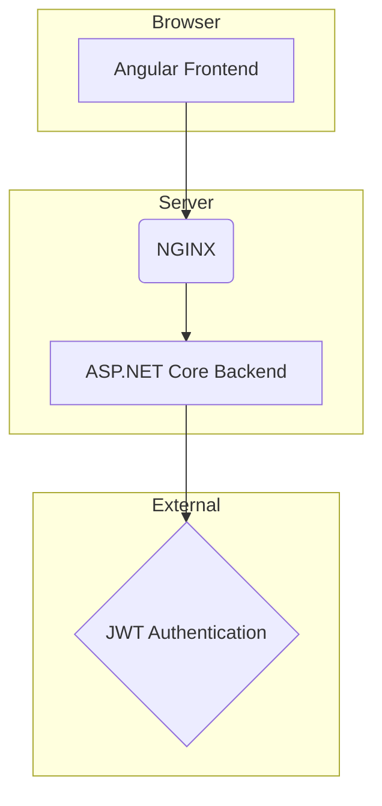

# Application Architecture

The Employee Management System is a single-page application (SPA) with a backend-for-frontend (BFF) architecture. The frontend is an Angular application, and the backend is an ASP.NET Core Web API. The entire application is designed to be containerized with Docker.

## High-Level Architecture

The following diagram illustrates the high-level architecture of the system:

- The **Angular Frontend** is the user interface of the application, running in the browser.
- **NGINX** acts as a reverse proxy, serving the Angular application and forwarding API requests to the ASP.NET Core backend.
- The **ASP.NET Core Backend** provides the API for the frontend, handling business logic and data persistence.
- **JWT Authentication** is used to secure the API.

## Containerization

The application is containerized using Docker. The `docker-compose.yml` file defines two services:

- **`angular-app`:** The Angular frontend application, served by NGINX.
- **`aspnet-api`:** The ASP.NET Core backend API.

This setup makes it easy to run the entire application with a single command.
